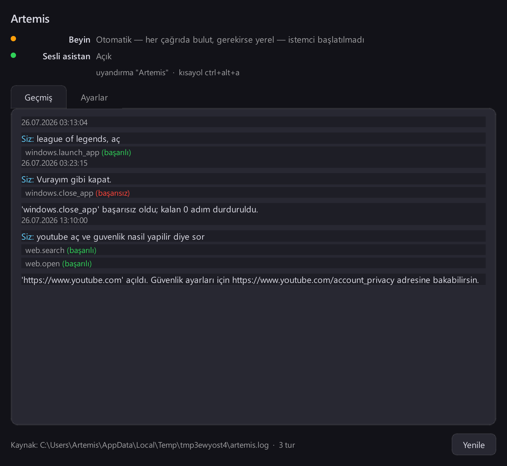
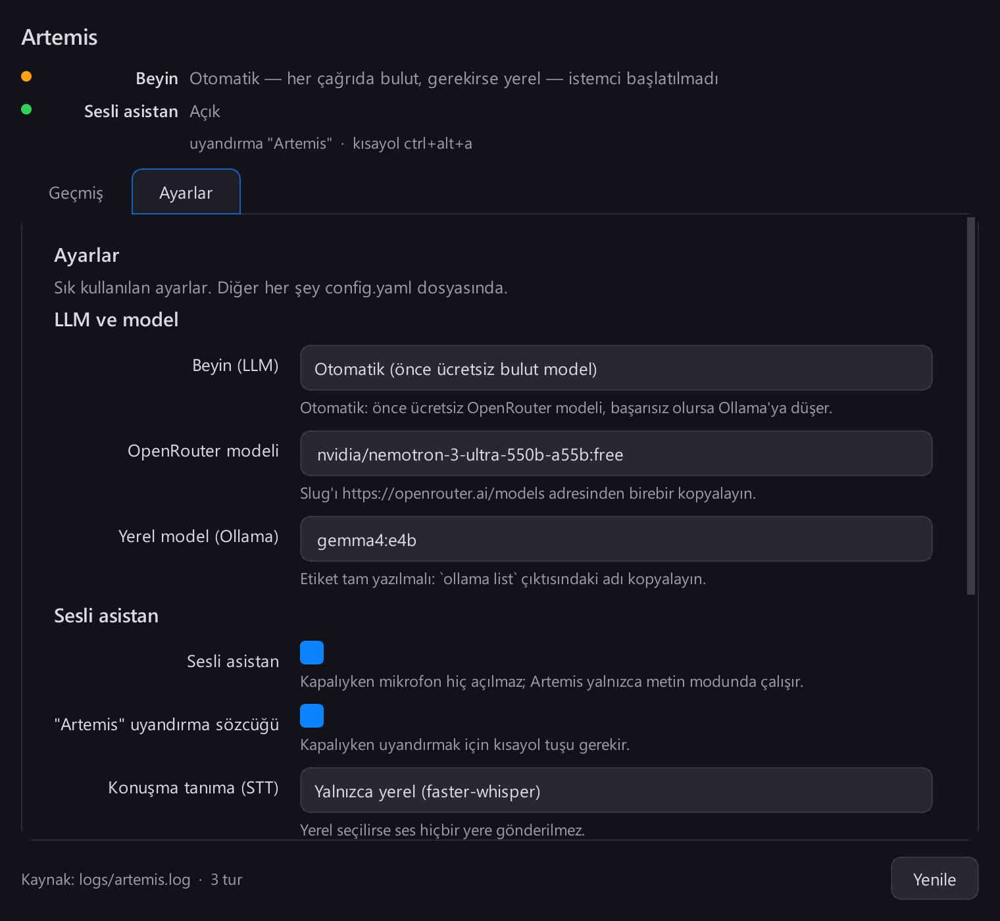

# Artemis — Yerel Sesli Yapay Zekâ Asistanı




[🇬🇧 English](./README.en.md)

## Açıklama

Artemis, Windows üzerinde çalışan ve Türkçe konuşan bir masaüstü asistanı:
söylediğiniz komutları alır ve bilgisayarınızda gerçekten işlem yapar — dosya
açar, klasör oluşturur, uygulama kapatır, internette arama yapar, ekran görüntüsü
alır. Model işletim sistemine hiçbir zaman doğrudan dokunmaz; yalnızca bir JSON
tool çağrısı üretir, `core/dispatcher.py` bunu doğrular ve çalıştırır. Her tool
bir `DangerLevel` bildirir, bu yüzden yıkıcı işlemler (silme, kapatma, kilitleme,
...) çalışmadan önce açık onay ister. Ses de hibrit: komut tanıma için
`faster-whisper`, konuşma cevabı için API anahtarı istemeyen Microsoft Edge TTS ve
yerel Piper yedeği. Beyin ise `llm_provider: "auto"` ile çalışır: bulut modeli
(OpenRouter) ile yerel Ollama arasında sessizce seçim yapar. Üç giriş noktası
aynı beyni paylaşır: `--chat` (terminal), `--chat-gui` (panel: geçmiş + ayarlar)
ve `--voice` (tepsi + overlay).

## Öne çıkanlar

- **Hibrit beyin**: `core/llm_router.py` her çağrıda OpenRouter ya da Ollama'yı
  seçer; bulut bir kez başarısız olursa bir bekleme süresi boyunca yerele düşer.
  Bulut yanıt verdiği sürece yerel model VRAM/RAM'e hiç yüklenmez, yani günlük
  kullanımda çok büyük bir indirme gerekmez.
- **Plugin mimarisi**: her yetenek (dosya sistemi, web, Windows kontrolü, ...)
  `@register_tool` ile kaydedilen kendi kendine yeten bir modüldür — 101'inci
  tool eklemek dispatcher'a veya ana döngüye dokunmayı gerektirmez. Bugün
  `filesystem.*`, `windows.*`, `browser.*`, `mouse_keyboard.*`, `memory.*`,
  `web.*`, `assistant.*`, `kule.*` ve `proje.*` altında toplam 41 tool var.
- **Yapısal güvenlik**: her tool bir `DangerLevel` bildirir; onayı, yıkıcı her şeyi
  zorunlu kılan tek nokta olan dispatcher uygular (dizin dışına sızmaya karşı
  korumanın kaynağı için `utils/paths.py::safe_join`'e bakın — her dosya sistemi
  tool'u hedefini bu fonksiyondan geçirir).
- **Yerel konuşma tanıma**: `faster-whisper` ile, bulut STT bağımlılığı yok;
  sürekli dinlenen "Artemis" uyandırma sözcüğü (küçük bir `tiny` Whisper modeli)
  ve alternatif tetikleyici olarak sistem geneli kısayol (`ctrl+alt+a`) var.
- **Çok adımlı planlama**: `core/planner.py` çok adımlı komutları sırayla yürütür
  ve bir adım başarısız olursa ya da kullanıcı onayı reddederse planı durdurur —
  geri kalanını körlemesine çalıştırmaz.
- **Tek pencere panel** (`ui/panel.py`, `ui/settings_window.py`), terminal
  `--chat`/`--voice` modlarının yanında. Panel mesaj YAZMAZ; sohbet geçmişini
  (`logs/artemis.log`'dan), ayarları ve asistanın durumunu gösterir. Metinle
  konuşmak `--chat`'te, sesle `--voice`'da yapılır.
- **Gerçek DOM seviyesinde tarayıcı otomasyonu**: kendi MCP sunucumuz
  (`mcp_servers/browser_automation_server.py`) Playwright üzerinden headless
  Chromium'u sürer — üçüncü taraf bir NPM paketi yok, *testleri* de ağ gerektirmez.
  Tool verilen `url`'ye gerçekten gider, yani internete çıkar; varsayılan olarak
  genel hostlarda yalnızca `http(s)://` adreslere sınırlıdır (aşağıya bakın).
- **Proje atölyesi ("Jarvis" modu)**: "yeni bir proje yapalım" dediğinde Artemis
  birkaç kısa soruyla projeyi netleştirir, bir `spec.md` çıkarır ve onayınla
  kodlamayı ARKA PLANDA Claude Code'a (`claude -p`, bütçe tavanlı) ya da cor
  üzerinden ücretsiz bir modele devreder. Sen sohbete devam edersin; iş bitince ya
  da kodlayıcı bir soru sorunca haber verir (aşağıya bakın).
- **883 otomatik test** (2'si `disruptive` işaretli olduğu için varsayılan olarak
  atlanır): dispatcher, planner, dosya sistemi güvenliği, OpenRouter istemcisi,
  ses hattı, arayüz — hepsi mock değil, gerçek davranış üzerinde.

## Kurulum ve çalıştırma

Python 3.11+ gerekir.

```bash
pip install -r requirements.txt      # ya da: pip install .
python scripts/setup_voice.py       # Piper TTS modeli, yalnızca --voice için gerekli

python main.py --chat               # metin modu (terminal)
python main.py --chat-gui           # panel: sohbet geçmişi + ayarlar
python main.py --settings           # ayarlar penceresini tek başına açar
python main.py --voice              # sesli asistan (faster-whisper + tepsi)
```

`--voice` ayrıca bir konuşma modeli ister; `faster-whisper` bunları ilk kullanımda
Hugging Face'ten indirip yerel önbelleğe alır: `large-v3-turbo` (komut tanıma) ve
`tiny` (uyandırma sözcüğü).

### Proje atölyesi: sohbetle proje, arka planda kodlama

`--chat` (ve `--voice`) içinde yeni bir proje fikrinden bahsetmen yeter:

```
Siz: yeni bir proje yapalım, notlarımı tutan küçük bir CLI
Artemis: Güzel, netleştirelim. ... İlki: bunu kim kullanacak ve çözdüğü asıl dert ne?
Siz: kendim, not kaybediyorum
Artemis: Python + SQLite öneriyorum, uygun mu?
Siz: olur, gerisini sen seç
Artemis: Spec hazır: ... Kodlayıcı: Claude (iş başı en fazla 5.00 $) ... 'başlat' de.
Siz: başlat
  'proje.islem' işlemi onay gerektiriyor. Argümanlar: islem: baslat, ad: not-cli, kodlayici: claude
  Devam edilsin mi? (e/h): e
Artemis: 'not-cli' kodlaması arka planda başladı (Claude). Klasör: ...\Desktop\Projeler\not-cli
...
Artemis: [proje] 'not-cli' tamamlandı (2 commit, ~0.84 $). Kodlayıcının özeti: M1 bitti, 12 test geçiyor. ...
```

- Görüşme açıkken yazdıkların tool seçimine değil görüşmeye gider; `vazgeç` kapatır.
- Kodlayıcı yalnızca proje klasöründe çalışır, yerel commit atar; `git push` ve
  remote ekleme komut düzeyinde yasaktır. Takıldığı gerçek bir karar olursa durur
  ve sorar: `not-cli için cevabım: SQLite kalsın` dersin, aynı oturumdan devam eder.
- `proje ne durumda`, `proje işlerini listele`, `not-cli'yi durdur` çalışır.
- **İkinci beyin (opsiyonel):** `config.yaml::projeler.vault_path` vault'unu
  gösterirse görüşme `Core.md`'deki kalıcı tercihlerini ve fikirle ilgili
  vault notlarını okur ("Vault'tan tercihlerini ve 2 notu okudum: ad-bir, ad-iki"),
  biten/soru soran/durdurulan her iş `300-Projects/<proje>.md` notuna eklenir
  ve bir receipt gönderilir. Var olan bir nota yalnızca EKLENİR, asla yeniden
  yazılmaz. Vault yoksa ya da CLI hata verirse işler etkilenmez.
- Gereken: Claude kodlayıcısı için `claude` CLI'ı (oturum açılmış), ücretsiz
  kodlayıcı için `cor`. Ayarlar `config.yaml::projeler` altında (proje kökü,
  bütçe, ücretsiz model, vault). Ayrıntı: `ARCHITECTURE.md` §42-§43.

### Beyin: bulut, yerel, ya da ikisi

`config/config.yaml::llm_provider` bunu belirler; varsayılan `"auto"` için ne
Ollama ne de büyük bir indirme gerekmez:

- **`auto`** (varsayılan) — `OPENROUTER_API_KEY` tanımlıysa ve erişilebiliyorsa
  OpenRouter, aksi halde yerel Ollama. Bulut bir kez başarısız olursa yönlendirici
  onu bir bekleme süresi boyunca devre dışı bırakır, yani ölü bir bağlantı her
  komutta yeniden denenmez.
- **`cloud`** — yalnızca OpenRouter; Ollama'ya hiç dokunmaz.
- **`local`** — yalnızca Ollama. Sunucuyu elle başlatabilir ya da Artemis arka
  planda başlatabilir: çalışmıyorsa Artemis onu kendisi ayağa kaldırır ve
  çıkışta **yalnızca kendi başlattığı** süreci kapatır. Kurulu modeller listelenir
  ve numarayla seçersiniz, yani `config.yaml`'a yazılacak bir şey yoktur
  (`ollama_model` alanı yalnızca etkileşimsiz senaryolar için yedektir).

```bash
ollama pull gemma4:e4b        # ya da kullanmak istediğiniz model
```

API anahtarları `config.yaml`'dan ASLA okunmaz — o dosya git ile izlenir.
Sırasıyla şu kaynaklardan okunur: ortam değişkenleri (`OPENROUTER_API_KEY`,
`GROQ_API_KEY`, `AZURE_SPEECH_KEY` + `AZURE_SPEECH_REGION`), sonra
`config/secrets.yaml` (git'e eklenmez), en son Windows kayıt defteri.

Bir IDE süreci sert kapatırsa (VS Code'un "Stop" düğmesi) arkada yetim bir
`ollama` süreci kalabilir; elle temizlemek için:

```bash
python main.py --stop-ollama
```

### Tarayıcı otomasyonu (opsiyonel, varsayılan kapalı)

`pip install` yalnızca *Python paketini* getirir; Chromium'un kendisi ayrı bir
indirmedir ve **yalnızca** tarayıcı otomasyon sunucusu için gerekir:

```bash
python -m playwright install chromium
```

Etkinleştirmek için `config/config.yaml` içindeki `mcp_servers:` bölümündeki
`browser` girdisinin yorumunu kaldırın (varsayılan gelir yorumlu olarak gelir,
böylece varsayılan kurulum sıfır I/O yapar). `mcp_servers` varsayılan olarak
boştur — sunucu tanımlanmadığı sürece o bölüm hiçbir I/O yapmaz.

**Bunu açmadan önce — `run_browser_task` gerçekte ne yapabilir.** Bu girdi
`trusted: true` ayarlar, yani tool `DangerLevel.SAFE` olarak kaydedilir ve
**kullanıcıdan onay sormadan** çalışır. Bunun nedeni üçüncü taraf bir paket
değil de Artemis'in kendi kodu olması, ama "onay sormuyor" ile "zararsız" aynı
şey değildir — tool verilen `url`'ye gider ve bulduğu sayfaya yazı yazıp tıklayabilir.
Bunu sınırlı tutmak için sunucu tarayıcıyı başlatmadan *önce* adresi doğrular ve
varsayılan olarak yalnızca **genel** hostlarda `http://` ve `https://`'e izin
verir: `file://` (diskten SSH anahtarlarınızı okuyabilirdi), `data:`,
`javascript:` ve `127.0.0.1`, `192.168.x.x`, `169.254.169.254` gibi loopback /
özel / link-local adresler reddedilir. Kendi yerel servisinizi (örn.
`http://localhost:3000`) otomatikleştirmek için o girdide
`env: {"ARTEMIS_BROWSER_ALLOW_LOCAL": "1"}` ayarlayın — bu yalnızca host
kontrolünü açar, `http(s)`-only şema kuralını asla.

## Testler

```bash
pytest
```

`disruptive` işaretli testler çalıştırıldıkları makinenin ekranını kilitler ve
sesini kapatır, bu yüzden varsayılan olarak atlanır; yalnızca bunu isterseniz
açıkça çalıştırın.

## Proje yapısı

```
main.py            giriş noktaları (--chat, --chat-gui, --voice, --settings, --stop-ollama)
core/              dispatcher, planner, LLM istemcileri + yönlendirici, plugin yükleyici, manifest
config/            Settings (pydantic) + config.yaml
plugins/           yetenek başına bir dosya (filesystem, web, windows, ...)
mcp_servers/       kendi MCP sunucularımız, örn. Playwright tarayıcı otomasyonu
voice/             ses kaydı, STT, TTS, uyandırma sözcüğü, sağlayıcı yedek yönlendiricisi
ui/                PyQt6 panel, sohbet penceresi, overlay, tepsi, kısayol, ayarlar, tema
memory/            SQLite tabanlı anahtar-değer bağlam hafızası
tests/             yukarıdakileri kapsayan 840 test
```

## Mimari derinlemesine

Tüm tasarım günlüğü — v0.1'den bugünkü sürüme kadar her mimari karar, ve bir
güvenlik sertleştirme turunda bulunup düzeltilen iki gerçek hata dâhil —
[`ARCHITECTURE.md`](./ARCHITECTURE.md) dosyasındadır.
